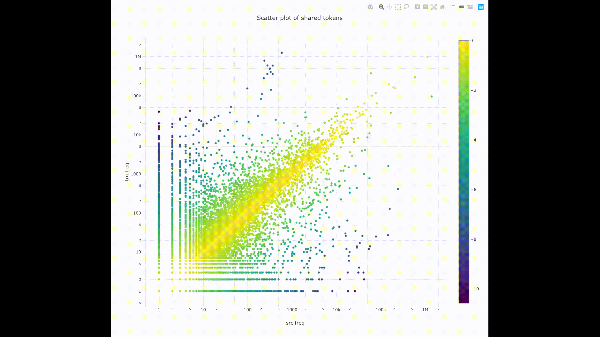
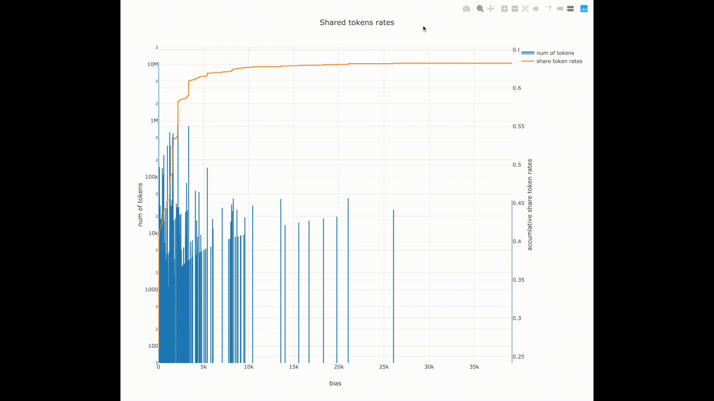
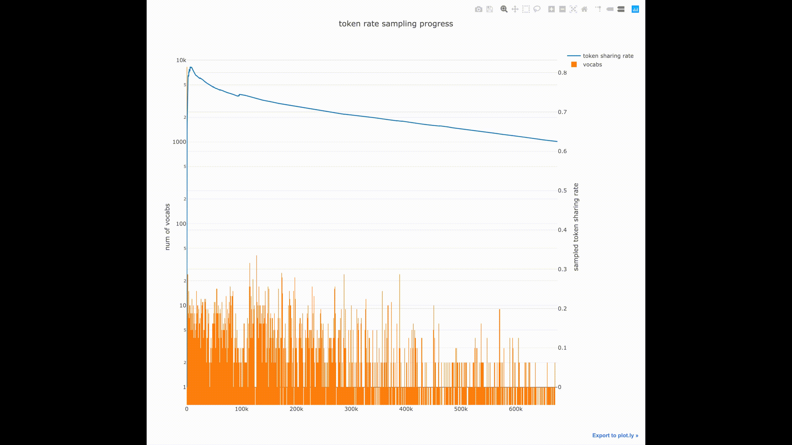

# textprep

Textprep is an analyzing tool for both parallel and non-parallel corpus and its down-stream Natural Language Processing and Machine Translation tasks. It is designed especially for logographic languages such as Chinese and Japanese, which can help you do the following:

1. Decomposing characters into ideographs and strokes. (Thanks to the [CHISE](http://www.chise.org/) project and [cjkvi-ids](https://github.com/cjkvi/cjkvi-ids) project)
2. Drawing offline plot.ly graphs showing relationship between shared types and tokens between two languages.
3. Sampling translation corpus to given token shared rate.

# requirements

```
numpy==1.16.0
tqdm==4.29.1
plotly==3.5.0
```

# usage

```
python textprep.py {decomp,draw,sample} ...
```

Details pleas use `-h`.

## decomp

```
usage: textprep.py decomp [-h] [-r REVERSE] -v VOCAB_DECOMP [--vocab VOCAB]
                          [-l {ideo_raw,ideo_finest,stroke}] [-i IDC]
                          [-o OUTPUT_FNAME]
                          fname

positional arguments:
  fname                 the input fname.

optional arguments:
  -h, --help            show this help message and exit
  -r REVERSE, --reverse REVERSE
                        whether to reverse process the input file. If True:
                        compose back to normal text file from input fname and
                        vocab fname; Else: do the normal decomposition.
  -v VOCAB_DECOMP, --vocab_decomp VOCAB_DECOMP
                        the vocab_decomp fname. in decomp process, vocab file
                        will be generated automatically; in comp process,
                        vocab file must exist to be read from.
  --vocab VOCAB         the vocab fname. not given, generate vocab from fname.
  -l {ideo_raw,ideo_finest,stroke}, --level {ideo_raw,ideo_finest,stroke}
                        to what level should the decomposition be.
  -i IDC, --idc IDC     whether to include structual IDCs in the decomp.
                        (yes/no)
  -o OUTPUT_FNAME, --output_fname OUTPUT_FNAME
                        the output file name.
```

## draw

```
usage: textprep.py draw [-h] [--type {scatter,rate,both}]
                        [--output_prefix OUTPUT_PREFIX]
                        src_fname trg_fname

positional arguments:
  src_fname             the source file name.
  trg_fname             the target file name

optional arguments:
  -h, --help            show this help message and exit
  --type {scatter,rate,both}
                        whether to only draw shared tokens
  --output_prefix OUTPUT_PREFIX
                        output prefix.
```
            
## sample

Note that this command requires heavy computation depends on your dataset.

```
usage: textprep.py sample [-h] [-n N] [-r R] [-k K] [-d DRAW]
                          src_fname trg_fname

positional arguments:
  src_fname             source file name.
  trg_fname             target file name.

optional arguments:
  -h, --help            show this help message and exit
  -n N                  num of sampled sentences. should not larger than num
                        of lines in either files.
  -r R                  the target share token rate for sampling.
  -k K                  num of sents extracted for each sample step.
  -d DRAW, --draw DRAW  if given, draw a graph of sampling process. should end
                        with .html
  --src_output SRC_OUTPUT
                        source output filename.
  --trg_output TRG_OUTPUT
                        target output filename.
```

## vocab
```
usage: vocab.py [-h] [input [input ...]] vocab

positional arguments:
  input       input fnames.
  vocab       output vocab fname.
```

# examples

## decomp chinese data to ideograph, finest ideograph and stroke level

original text:

```
机器人 行业 在 环境 问题 上 的 措施
```

ideograph:

```
⿰木几⿳吅犬吅人 ⿰彳亍⿱⿻⿰丨丨⿰丶丿一 ⿸⿱⿻一丿丨土 ⿰王不⿰土竟 ⿵门口⿺是页 ⿱⺊一 ⿰白勺 ⿰扌昔⿰方㐌
```

ideograph-finest:

```
⿰木几⿳⿰口口犬⿰口口人 ⿰彳⿱一⿱一亅⿱⿻⿰丨丨⿰丶丿一 ⿸⿱⿻一丿丨⿱十一 ⿰
⿱一⿱十一⿱一⿸⿸丿丨丶⿰⿱十一⿱⿱⿱⿱⿱丶一丷一日⿰丿乚 ⿵门口⿺⿱日⿱一龰页 ⿱⺊一 ⿰白⿹勹一 ⿰扌⿱⿱⿻十丨一日⿰⿱⿱丶一⿰丿𠃌⿱𠂉也
```

stroke:

```
⿰⿻⿻一丨⿰丿乀⿰㇓乙⿳⿰⿱⿰丨𠃌一⿱⿰丨𠃌一⿻一⿸丿乀⿰⿱⿰丨𠃌一⿱⿰丨𠃌一⿸丿乀 ⿰⿳丿丿丨⿱一⿱一亅⿱⿻⿰丨丨⿰丶丿一 ⿸⿱⿻一丿丨⿱⿻一丨一 ⿰⿱一⿱⿻一
丨一⿱一⿸⿸丿丨丶⿰⿱⿻一丨一⿱⿱⿱⿱⿱丶一⿰丶丿一〾⿵⿰丨𠃌⿱一一⿰丿乚 ⿵⿰
⿱丶丨𠃌⿱⿰丨𠃌一⿺⿱〾⿵⿰丨𠃌⿱一一⿱一⿺⿰丨一⿸丿乀⿳一丿⿵⿰丨𠃍⿸丿乀 ⿱
⿰丨一一 ⿰⿱丿〾⿵⿰丨𠃌⿱一一⿹〾〾⿻丿𠃌丶 ⿰⿻⿻一亅㇀⿱⿱⿻⿻一丨丨一〾⿵⿰丨𠃌⿱一一⿰⿱⿱丶一⿰丿𠃌⿱⿰丿一⿻丨⿻𠃌乚
```

## plotting the shared tokens

Scatter plot can show the shared tokens and their frequencies in both languages.



Rate plot can show the bias of shared tokens and the cumulative share token rate.



## sample for a given share token rate

Sample plot can show the on-the-fly share token rate and new vocabularies for each sample step.




# update history

- First commit: 2018/10/09
  - Create the basic decompse function.
  - Add apis to call other word tokenization tools (dict-based tokenization (Jieba, Mecab, Kytea), subword tokenization (Sentencepiece unigram/bpe), etc)
- Second commit: 2019/01/17
  - Remove apis for other tokenizers
  - Add draw and sample functions.